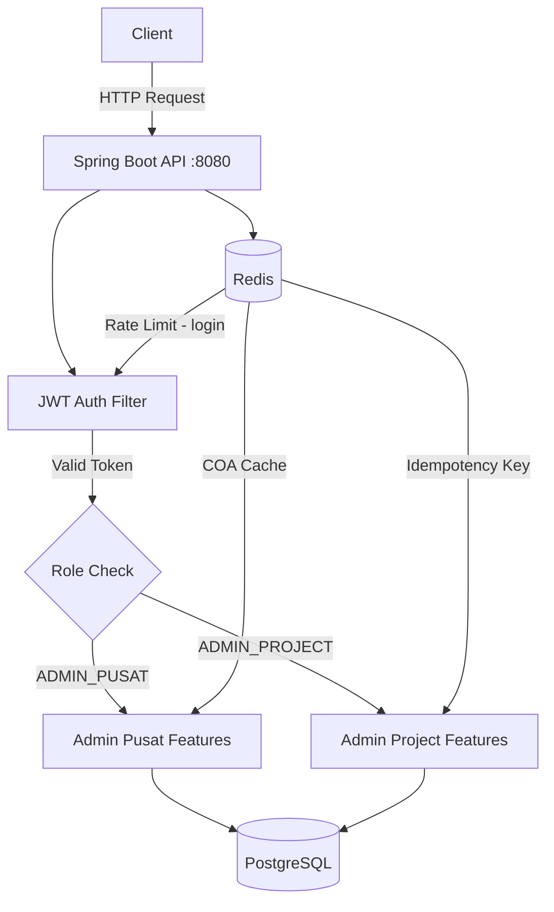
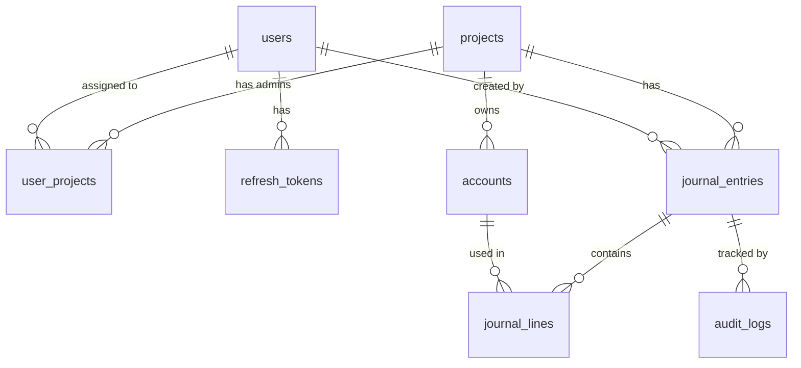
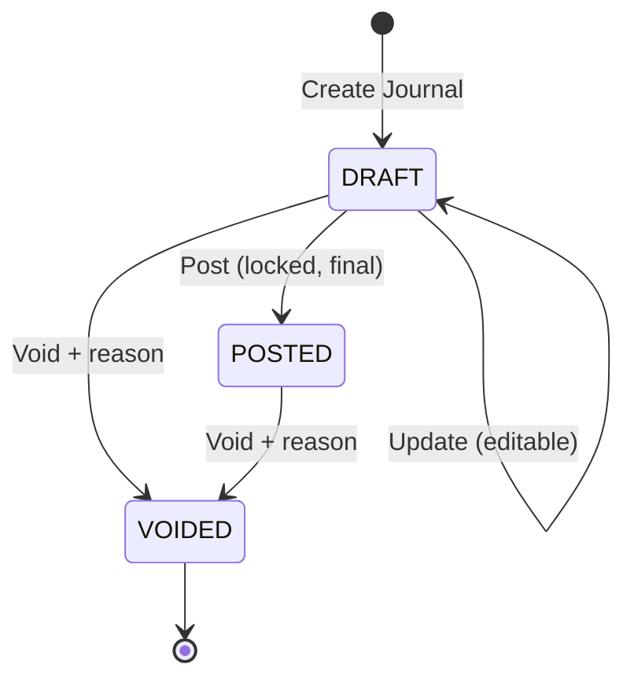

# BukuBesarKami — General Ledger API

A RESTful API for project-based financial recording using **double-entry bookkeeping**.  
Built to ensure accurate, traceable, and secure cash flow management across multiple projects.
  
**Stack:** Spring Boot 3.5.11 · Java 21 · PostgreSQL 16 · Redis 7 · Docker · JWT · Junit5 & Mockito 

**Try It Out** [bit.ly/gen-ledger-v1](https://bit.ly/gen-ledger-v1)

**Or** [https://multiple-brooke-zaid-anshori-e3835b81.koyeb.app/swagger-ui/index.html](https://multiple-brooke-zaid-anshori-e3835b81.koyeb.app/swagger-ui/index.html)

---

## Table of Contents

- [Overview](#overview)
- [Architecture](#architecture)
- [Key Features](#key-features)
- [Tech Stack](#tech-stack)
- [Getting Started](#getting-started)
- [API Endpoints](#api-endpoints)
- [Request Example](#request-example)
- [Security](#security)

---

## Overview

BukuBesarKami is a backend system for managing a general ledger (Buku Besar) across multiple projects under one organization. It supports two roles: a central admin who manages users, projects, and reports, and a project admin who handles daily transactions for their assigned project.

---

## Architecture

### Project Structure

```
src/main/java/com/bukubesarkami/
│
├── common/
│   ├── exception/          # AppException, GlobalExceptionHandler
│   └── util/               # ApiResponse, EntryNumberGenerator,
│                             SecurityUtil, IdempotencyService
│
├── config/                 # JWT, Security, Redis, RateLimiter, OpenAPI
│
├── core/
│   ├── entity/             # User, Project, Account, JournalEntry,
│   │                         JournalLine, AuditLog, RefreshToken
│   └── repository/         # 7 Spring Data JPA repositories
│
└── features/
    ├── auth/               # Login, register, refresh token, logout
    ├── adminpusat/         # User management, projects, COA, reports
    └── adminproject/       # Journal entries, budget summary
```

### System Flow



### Database Schema



### Journal Entry Lifecycle



---

## Key Features

| Feature | Implementation |
|---------|---------------|
| Double-entry validation | Checked at service layer (create, update, post) + DB constraint |
| Role-based access control | `@PreAuthorize` — project admins isolated to assigned projects only |
| Redis COA cache | `@Cacheable` on Chart of Accounts — reduces DB load on frequent reads |
| Rate limiting | Bucket4j + Redis — 5 requests/60s per IP on `/auth/login` |
| Idempotency key | `X-Idempotency-Key` header on journal creation, stored 24h in Redis |
| Pessimistic locking | `@Lock(PESSIMISTIC_WRITE)` on journal post/update — prevents race conditions |
| Refresh token rotation | Old token revoked on every refresh; device metadata stored |
| Async audit log | `@Async` + `REQUIRES_NEW` — every data change is logged (who, what, when) |
| Pagination | All list endpoints use `Page<T>` + `Pageable` — no unbounded queries |
| N+1 prevention | `@EntityGraph` on journal and account queries |
| SQL injection prevention | All queries use JPQL named parameters, no string concatenation |

---

## Tech Stack

| Layer | Technology |
|-------|-----------|
| Language | Java 21 |
| Framework | Spring Boot 3.5.11 |
| Security | Spring Security · JWT (JJWT 0.12.6) |
| Database | PostgreSQL 16 |
| Cache & Rate Limit | Redis 7 · Bucket4j 8.10.1 |
| ORM | Spring Data JPA · Hibernate |
| Migration | Flyway |
| Documentation | SpringDoc OpenAPI 2.8.5 (Swagger UI) |
| Containerization | Docker · Docker Compose |
| Utilities | Lombok |

---

## Getting Started

### Option A — Docker (Recommended)

**Prerequisites:** Docker + Docker Compose installed.

```bash
# 1. Clone the repository
git clone https://github.com/zaidnshr1/BukuBesarKita.git
cd BukuBesarKita

# 2. Set up environment variables
cp .env.example .env
# Edit .env and fill in your passwords and secrets

# 3. Build the JAR
mvn clean package -DskipTests

# 4. Start all services (PostgreSQL, Redis, pgAdmin, App)
docker compose up -d

# 5. Check status
docker compose ps
docker compose logs app --follow
```

**Services after startup:**

| Service | URL |
|---------|-----|
| API | http://localhost:8080 |
| Swagger UI | http://localhost:8080/swagger-ui.html |
| pgAdmin4 | http://localhost:5050 |
| Health check | http://localhost:8080/actuator/health |

---

### Option B — Local Development

**Prerequisites:** Java 21, Maven 3.9+, PostgreSQL 16+, Redis 7+

```bash
# 1. Create database
psql -U postgres -c "CREATE DATABASE bukubesarkami;"

# 2. Set environment variables
export DB_USERNAME=postgres
export DB_PASSWORD=your_password
export REDIS_PASSWORD=your_redis_password
export JWT_SECRET=YourSecretKeyMinimum32CharactersLong!

# 3. Run
mvn spring-boot:run
```

---

### Environment Variables

Copy `.env.example` to `.env` and fill in the values. **Never commit `.env` to Git.**

```env
DB_HOST=localhost
DB_PORT=5432
DB_NAME=bukubesarkami
DB_USERNAME=postgres
DB_PASSWORD=your_secure_password

REDIS_HOST=localhost
REDIS_PORT=6379
REDIS_PASSWORD=your_redis_password

JWT_SECRET=your_jwt_secret_minimum_32_characters
JWT_EXPIRATION_MS=3600000
JWT_REFRESH_EXPIRATION_MS=86400000

PGADMIN_EMAIL=admin@example.com
PGADMIN_PASSWORD=your_pgadmin_password
```

---

### Default Credentials (from seed data)

```
username: adminpusat
password: Admin@123
```

> **Change this immediately on any non-local environment.**

---

## API Endpoints

### Auth — Public
| Method | Endpoint | Description |
|--------|----------|-------------|
| POST | `/api/v1/auth/register` | Register Admin Pusat |
| POST | `/api/v1/auth/login` | Login (rate limited: 5 req/60s per IP) |
| POST | `/api/v1/auth/refresh-token` | Refresh access token |
| POST | `/api/v1/auth/logout` | Revoke all tokens |
| GET  | `/api/v1/auth/me` | Current user info |

### Admin Pusat — `ADMIN_PUSAT` role required
| Method | Endpoint | Description |
|--------|----------|-------------|
| POST | `/api/v1/admin-pusat/users` | Create project admin |
| GET  | `/api/v1/admin-pusat/users` | List all users |
| PATCH | `/api/v1/admin-pusat/users/{id}/toggle-status` | Enable / disable user |
| POST | `/api/v1/admin-pusat/projects` | Create project |
| GET  | `/api/v1/admin-pusat/projects` | List all projects |
| PUT  | `/api/v1/admin-pusat/projects/{id}` | Update project |
| POST | `/api/v1/admin-pusat/projects/{id}/assign-admin` | Assign admin to project |
| DELETE | `/api/v1/admin-pusat/projects/{id}/remove-admin/{uid}` | Remove admin from project |
| POST | `/api/v1/admin-pusat/accounts` | Create COA account |
| GET  | `/api/v1/admin-pusat/accounts/global` | Global accounts (cached) |
| GET  | `/api/v1/admin-pusat/accounts/project/{id}` | Accounts for project (paginated) |
| GET  | `/api/v1/admin-pusat/reports/profit-loss` | P&L across all projects |
| GET  | `/api/v1/admin-pusat/reports/profit-loss/{id}` | P&L per project |
| GET  | `/api/v1/admin-pusat/reports/trial-balance/{id}` | Trial balance |
| GET  | `/api/v1/admin-pusat/audit-logs` | All activity logs |
| GET  | `/api/v1/admin-pusat/audit-logs/project/{id}` | Activity logs per project |

### Admin Project — `ADMIN_PROJECT` or `ADMIN_PUSAT`
| Method | Endpoint | Description |
|--------|----------|-------------|
| POST | `/api/v1/project/journals` | Create journal entry (requires `X-Idempotency-Key`) |
| GET  | `/api/v1/project/journals/project/{id}` | Transaction history (paginated) |
| GET  | `/api/v1/project/journals/{id}` | Journal detail with all lines |
| PUT  | `/api/v1/project/journals/{id}` | Update journal (DRAFT only) |
| POST | `/api/v1/project/journals/{id}/post` | Post journal (DRAFT → POSTED) |
| POST | `/api/v1/project/journals/{id}/void` | Void journal with reason |
| GET  | `/api/v1/project/budget/{projectId}` | Project budget summary |

---

## Request Example

**Create Journal Entry**

```http
POST /api/v1/project/journals
Authorization: Bearer {access_token}
X-Idempotency-Key: 550e8400-e29b-41d4-a716-446655440000
Content-Type: application/json

{
  "projectId": "uuid-project",
  "entryDate": "2026-06-01",
  "description": "Purchase of project materials",
  "referenceNumber": "INV-2026-001",
  "lines": [
    {
      "accountId": "uuid-expense-account",
      "debitAmount": 5000000,
      "creditAmount": 0,
      "description": "Material expense"
    },
    {
      "accountId": "uuid-cash-account",
      "debitAmount": 0,
      "creditAmount": 5000000,
      "description": "Cash payment"
    }
  ]
}
```

**Unbalanced entry response (422):**
```json
{
  "status": 422,
  "error": "Unprocessable Entity",
  "message": "Jurnal tidak seimbang: total debit harus sama dengan total kredit."
}
```

**Rate limit exceeded response (429):**
```json
{
  "status": 429,
  "error": "Too Many Requests",
  "message": "Terlalu banyak percobaan login. Coba lagi dalam 60 detik."
}
```

---

## Security

- **JWT** — access token (1 hour), refresh token (24 hours) with rotation
- **Refresh token metadata** — IP address and User-Agent stored; suspicious device changes are detectable
- **Rate limiting** — Bucket4j + Redis on login endpoint (5 attempts per 60 seconds per IP)
- **Idempotency key** — prevents duplicate journal submissions from network retry or double-click
- **Pessimistic locking** — prevents race conditions on concurrent journal operations
- **RBAC** — project admins can only access their assigned projects; cross-project data access is blocked
- **Audit log** — every data change records the actor, action, entity, and timestamp
- **BigDecimal** — all monetary values use `BigDecimal(19,2)` to avoid floating-point errors
- **Flyway** — database schema versioned and migration-controlled

---
